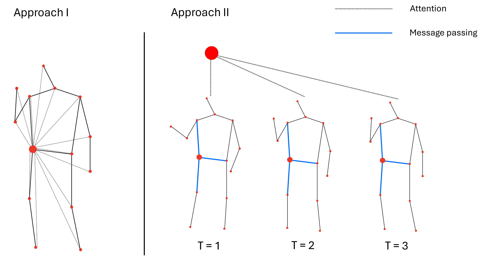

This project is based on [GaitGraph](https://github.com/tteepe/GaitGraph).
To run this, download gait graph and replace the src folder with the folder from this repository.

To run hyper-parameter optimization, run one of src/tuning_gt.py and src/tuning_resgcn_transformer.py files (Optuna installation is necessary). \
To run the networks with optimized parameters, run one of g_transformer.sh and resgcn_transformer.sh files.

